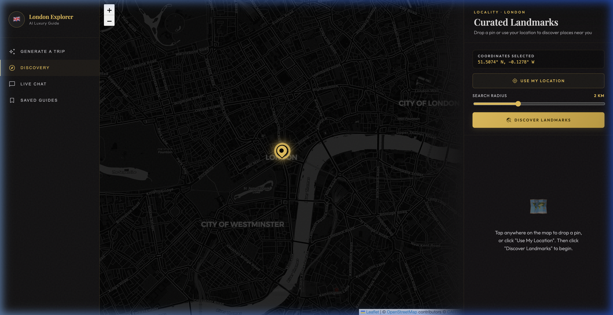
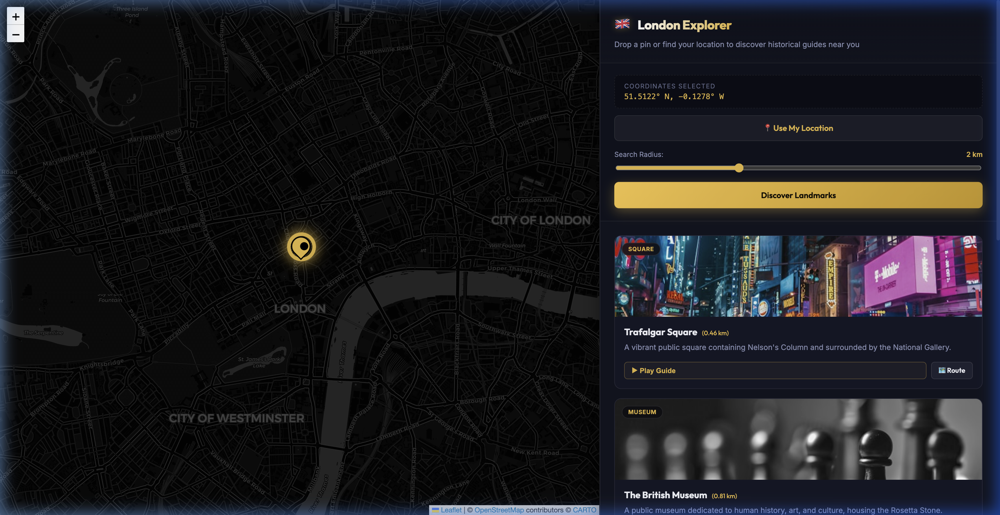
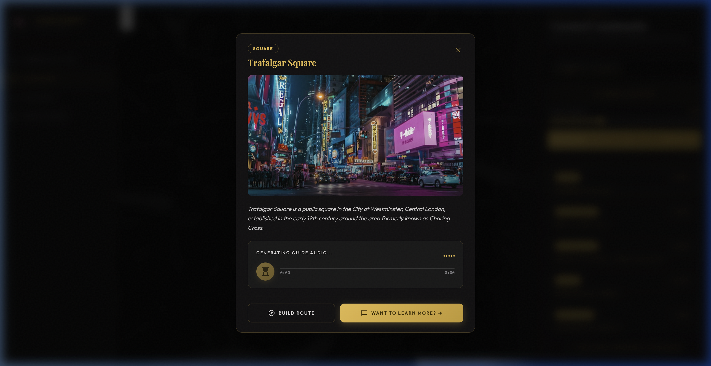
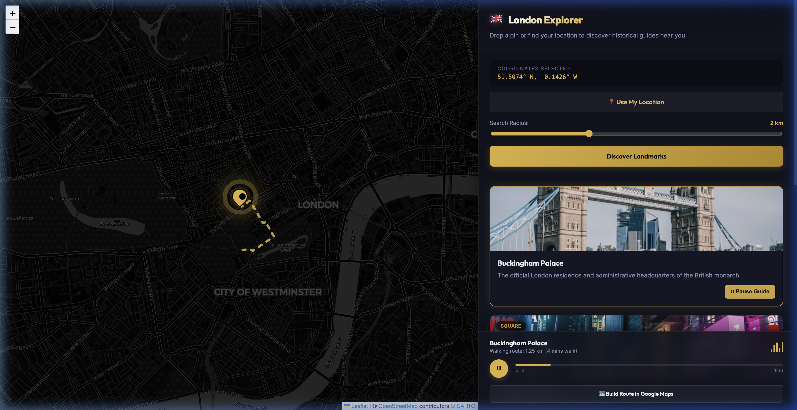
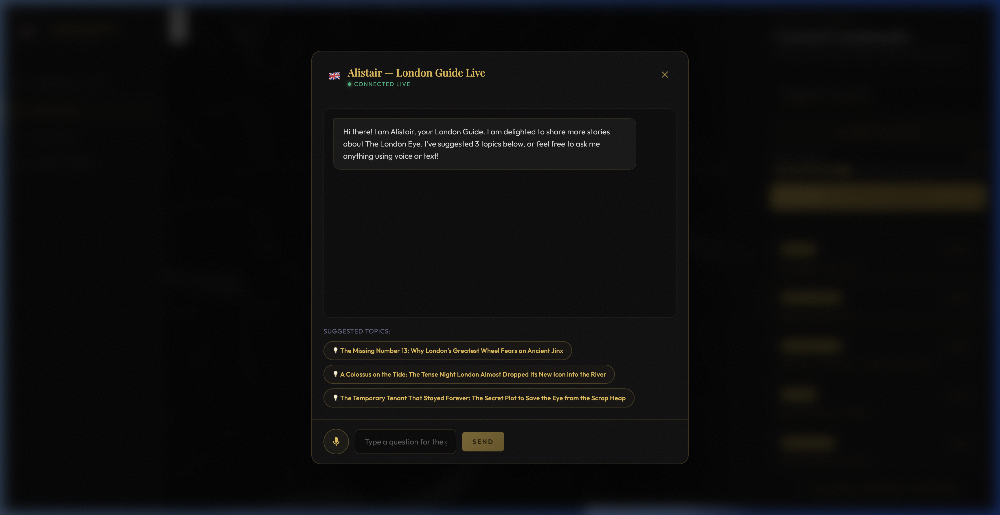
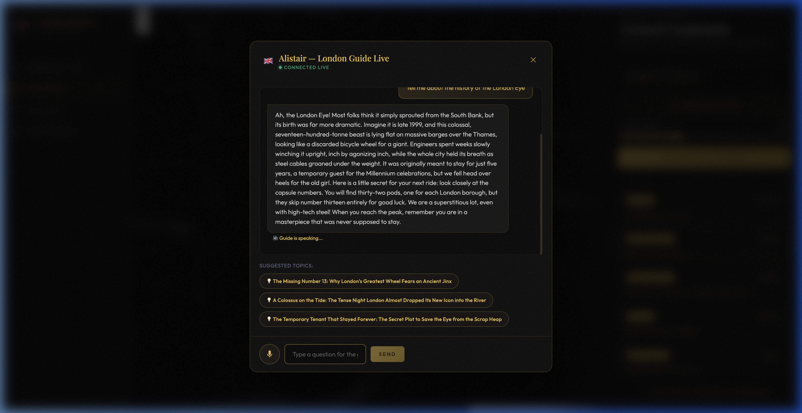
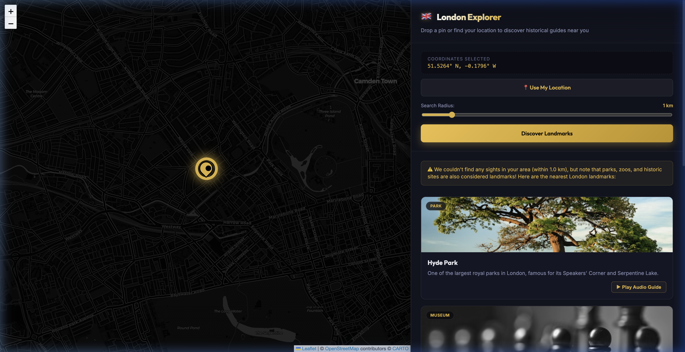

<div align="center">

# 🇬🇧 London Explorer — AI Audio Guide

**An AI-powered audio walking guide built with Google ADK, Gemini TTS, and React 19**

[](https://python.org)
[](https://fastapi.tiangolo.com)
[](https://react.dev)
[](https://google.github.io/adk-docs/)
[](LICENSE)

</div>

---


---

## 🎬 Demo

[](https://youtu.be/19GDGF6QLfw)

> *Click the thumbnail above to watch the full demo on YouTube*

---

## ✨ What It Does

Drop a pin on the map → get an AI-curated list of nearby London landmarks sorted by proximity → tap any card to hear a **bespoke audio guide narrated by Alistair**, a warm British AI storyteller → ask Alistair anything in a **live conversational chat**.

All powered by **Google ADK 2.0 multi-agent pipelines**, **Gemini 3 Flash** on Vertex AI, and **Gemini native TTS**.

---

## 📸 Screenshots

### 1. Landing Page — Interactive Dark Map
Drop a pin anywhere or use your GPS location. Adjust the search radius with the slider.



---

### 2. Landmark Discovery — Sorted by Proximity
AI-curated landmark cards with category badges and distance pills, sorted closest-first.



---

### 3. Landmark Detail Modal
Tap a card to open the glassmorphic detail modal with hero image, description, and the live audio guide player.



---

### 4. AI Audio Guide Player
Gemini generates a 150–250 word narration script and voices it in real-time with a warm British accent. Gold waveform player with progress bar and play/pause.



---

### 5. Live Chat — Suggested Topics
Click "Want to learn more?" to open Alistair's conversational chat. AI generates 3 cinematic story-driven topic chips.



---

### 6. Live Conversational Chat with Alistair
Ask anything. Alistair responds with vivid historical stories and hidden anecdotes — and speaks his answer aloud via TTS.



---

### 7. Out-of-Radius Fallback
If no landmarks are within range, the app shows a warning and falls back to the nearest curated London landmarks.



---

## 🏗️ Architecture

```
┌─────────────────────────────────────────────────┐
│                  React Frontend                 │
│  Leaflet Map · Glassmorphic Cards · Audio Player │
│  Live Chat Modal · Material Symbols Icons        │
└──────────────────────┬──────────────────────────┘
                       │ REST API
┌──────────────────────▼──────────────────────────┐
│           FastAPI Backend (Python)               │
│  CORS · Session Management · Streaming Responses │
└──────┬──────────────┬────────────────┬───────────┘
       │              │                │
┌──────▼──────┐ ┌─────▼──────┐ ┌──────▼──────────┐
│  ADK Agent  │ │  ADK Agent  │ │   ADK Agents    │
│  Pipeline   │ │  Pipeline   │ │  Chat + Topics  │
│  Places     │ │  Narration  │ │                 │
│  Discovery  │ │  Writer     │ │  Suggestion     │
└──────┬──────┘ └─────┬──────┘ └──────┬──────────┘
       │              │                │
┌──────▼──────────────▼────────────────▼──────────┐
│  Vertex AI (Gemini 3 Flash) · Places API (New)  │
│  Gemini TTS · OSRM Routing                      │
└─────────────────────────────────────────────────┘
```

---

## 🛠️ Tech Stack

| Layer | Technology |
| :--- | :--- |
| **Frontend** | React 19, Vite, Leaflet / react-leaflet, Vanilla CSS |
| **UI Design** | Glassmorphism, Playfair Display + Outfit fonts, Material Symbols |
| **Backend** | FastAPI (Python 3.13), uvicorn |
| **AI Agents** | Google ADK 2.0 — `Agent`, `SequentialAgent`, `Runner` |
| **LLM** | Gemini 3 Flash on Vertex AI (`gemini-3-flash-preview`) |
| **TTS** | Gemini Interactions API (`gemini-3.1-flash-tts-preview`) |
| **Places Data** | Google Places API (New) + curated fallback dataset |
| **Routing** | OSRM open-source routing engine |
| **Session State** | ADK `InMemorySessionService` (per-agent namespaced) |

---

## 🚀 Quick Start

### Prerequisites

- Python 3.13+ with [uv](https://docs.astral.sh/uv/)
- Node.js 18+
- Google Cloud project with Vertex AI enabled
- `gcloud auth application-default login` configured

### 1. Backend

```bash
cd backend
make install          # Install Python deps with uv
```

Set environment variables:

```bash
export GOOGLE_CLOUD_PROJECT=your-project-id
export GOOGLE_API_KEY=your-gemini-api-key          # For TTS
export GOOGLE_PLACES_API_KEY=your-places-api-key   # Optional — uses curated fallback without it
```

Start the server:

```bash
uv run uvicorn main:app --host 127.0.0.1 --port 8000 --reload
```

API docs available at **http://localhost:8000/docs**

### 2. Frontend

```bash
cd frontend
npm install
npm run dev
```

App available at **http://localhost:5173**

---

## 🔌 API Reference

| Endpoint | Method | Description |
| :--- | :--- | :--- |
| `/api/places` | `POST` | Run ADK pipeline — discover & rank nearby landmarks |
| `/api/narrate` | `POST` | Generate narration script → stream MP3 audio |
| `/api/chat/suggest` | `POST` | Return 3 AI story-driven topic suggestions |
| `/api/chat` | `POST` | Multi-turn conversational chat with Alistair |
| `/api/tts` | `POST` | Synthesise any text to MP3 stream |
| `/api/photo` | `GET` | Proxy Google Places photo (bypass CORS) |

---

## 🤖 ADK Agent Patterns

Three distinct ADK patterns are demonstrated in this POC:

| Pattern | Where Used | Why |
| :--- | :--- | :--- |
| **Sequential Pipeline** | Places Discovery | Fetch raw data → format to typed Pydantic schema |
| **Stateful Single Agent** | Narration Writer | Pre-populated session state drives personalised output |
| **Multi-turn Conversational Agent** | Alistair Live Chat | Session persistence enables contextual follow-up Q&A |

---

## 📁 Project Structure

```
london-guide/
├── backend/
│   ├── app/
│   │   ├── agent.py        # ADK agents: Places pipeline, Narration, Chat, Suggestions
│   │   ├── tools.py        # Google Places API tool + curated London fallback dataset
│   │   └── tts.py          # Gemini TTS streaming with gTTS fallback
│   ├── main.py             # FastAPI server with all endpoints
│   ├── tests/              # Unit + integration + eval tests
│   └── pyproject.toml      # Python dependencies (uv)
├── frontend/
│   ├── src/
│   │   ├── App.jsx         # Main React component (map, cards, modals, chat)
│   │   └── index.css       # Stitch design system tokens + glassmorphic styles
│   └── index.html
├── docs/screenshots/       # App screenshots for documentation
├── POC.md                  # Full proof-of-concept description
└── README.md               # This file
```

---

## 🔒 Security

All API keys are loaded exclusively from environment variables at runtime — **no secrets are hardcoded** anywhere in the source.

See `.env.example` for the required variables:

```bash
GOOGLE_CLOUD_PROJECT=your-project-id
GOOGLE_API_KEY=your-gemini-api-key
GOOGLE_PLACES_API_KEY=your-places-api-key   # optional
```

---

## 📄 License

Apache 2.0 — see [LICENSE](LICENSE)

---

<div align="center">

*Built with Google ADK 2.0 · Gemini 3 Flash · Gemini TTS · React 19 · FastAPI*

</div>
